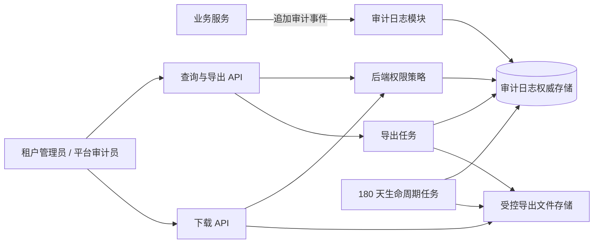

## 多租户只读审计日志系统设计

以题设前提为准：日志保留 180 天；租户管理员仅可查询本租户；平台审计员可跨租户；导出异步执行。当前未提供宿主系统的认证、数据库、任务框架与容量基线，因此以下为可落地的单体优先设计，实施状态为 `DIRECTION_UNPROVEN`。

### 业务目标与边界

审计日志用于回答“谁在何时、以何种身份、对哪个租户范围内的资源做了什么，以及结果如何”。

- 审计日志对业务用户只读：不提供修改、删除接口。
- 系统写入采用追加式；满 180 天后仅由受控的生命周期任务清理。
- 不将“前端隐藏入口”视为权限控制；查询、导出、下载均由后端授权。
- 导出是离线任务，避免大查询阻塞在线检索与主业务请求。

### 推荐路线

| 路线 | 适用性 | 结论 |
|---|---|---|
| 复用现有单体数据库与任务能力 | 低成本、边界清晰、便于一致性与运维 | 推荐 |
| 独立审计微服务/专用日志平台 | 适合已有高吞吐、跨系统合规平台 | 当前容量与现状未知，不建议预设 |
| 同步生成导出文件 | 简单但易超时、影响主库 | 不满足异步导出要求 |

### 架构与职责

审计日志模块是唯一写入入口；查询、导出和保留策略均复用同一套租户范围与权限规则，避免在前后端或不同接口中各自定义。

### 核心领域与数据契约

`AuditLog` 是唯一事实源，至少包含：

- `id`：不可猜测的日志标识。
- `occurred_at`：事件发生时间。
- `tenant_id`：归属租户，平台级事件可采用明确的约定值，不能省略范围语义。
- `actor_type`、`actor_id`：操作者身份。
- `action`：标准化动作名。
- `resource_type`、`resource_id`：被操作资源。
- `result`：成功、拒绝或失败。
- `request_id`：用于关联请求与排障。
- `metadata`：受治理的补充上下文；不得默认记录密码、令牌、完整个人敏感信息或原始请求体。
- `expires_at`：由 `occurred_at + 180 天` 派生，作为清理依据。

建议按 `(tenant_id, occurred_at)` 建立查询索引；平台审计员跨租户查询仍必须有时间范围和分页上限，防止全表扫描。

`ExportJob` 独立记录导出生命周期：

`PENDING → RUNNING → SUCCEEDED | FAILED | EXPIRED`

其中保存提交人、授权时的范围快照、筛选条件、日志截止时间、水印、文件引用、失败原因与过期时间。下载时重新授权，不因任务曾创建成功而永久获得数据访问权。

### 权限契约

| 主体 | 范围 | 动作 |
|---|---|---|
| 租户管理员 | 当前已验证的 `tenant_id` | 查询、创建本租户导出任务、下载仍有权限的本租户文件 |
| 平台审计员 | 后端授予的平台审计范围 | 跨租户查询、创建跨租户导出任务、下载仍有权限的文件 |
| 其他主体 | 无 | 拒绝查询、导出、下载 |

后端在查询条件构造、创建导出任务、任务执行和文件下载四处校验范围；租户管理员传入的 `tenant_id` 不可作为可信边界。前端仅据后端返回的权限状态控制入口显隐、禁用与提示。

### 导出流程与故障处理

1. 用户提交筛选条件；后端校验权限、时间范围与导出上限，创建任务后立即返回任务 ID。
2. 工作进程按任务中的范围快照读取日志，生成文件并写入受控存储。
3. 任务完成后提供状态查询；下载接口再次核验当前权限。
4. 任务重复提交通过请求幂等键合并；任务失败记录可诊断原因，有限次数重试。
5. 文件与任务元数据的保留期不得超过对应日志的可访问期；清理失败应告警并可重试，不能静默延长留存。

### 迁移、回滚与验收

- 迁移：先启用新日志写入，再开放只读查询；历史回填仅在明确了历史来源、完整性与合规边界后进行。
- 回滚：关闭查询、导出入口和新写入调用即可；保留已写日志，不执行破坏性回删。
- 验收证据：180 天到期清理、租户间越权查询与下载均被拒绝、平台审计员跨租户结果正确、导出请求不阻塞在线接口、导出范围与下载再鉴权一致。

实施前的最小缺口：现有身份与角色权威入口、租户上下文传递方式、现有数据库/索引能力、异步任务与文件存储能力、预期日志量与允许的导出文件格式/大小。这些信息决定具体接口、分区/索引和限额，未确认前不应固化技术选型或数据迁移。
